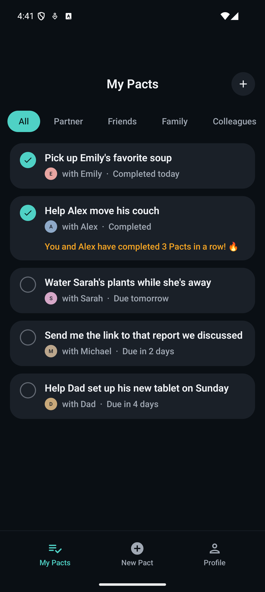
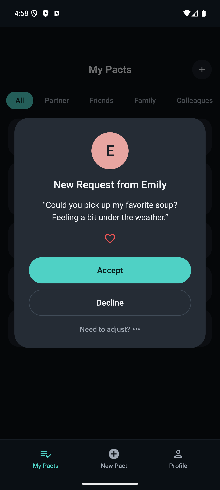
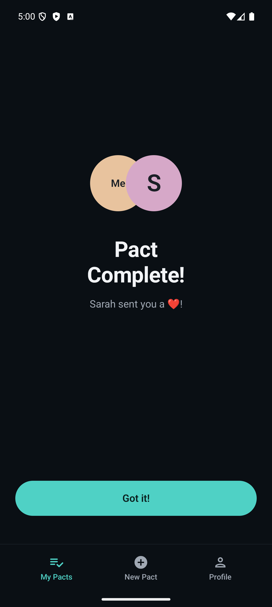
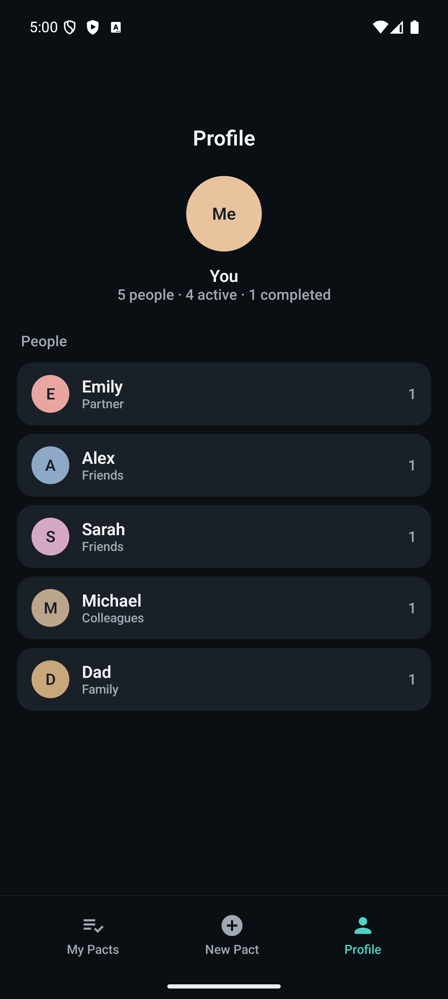

<div align="center">
  
</div>

# Pact

**A relationship app for tracking commitments between you and the people in your life.**

Turn good intentions into reliable actions. Pact helps you keep promises to partners, roommates, family, and friends—strengthening trust through follow-through.

**🌐 Live Site**: [pact.llc](https://pact.llc)

## 📱 App preview

<p align="center">
  
  
  
  
</p>

<p align="center"><sub>Native Android prototype, built in Kotlin and Jetpack Compose. See <a href="#-native-android-app">all six screens</a> and <a href="#building-and-running">build instructions</a> below.</sub></p>

## 💡 Our "Why": The Story Behind Pact

We are building Pact because we believe that the foundation of every great relationship—whether with a partner, a friend, a family member, or a colleague—is built on a simple, powerful idea: trust. And trust is built on kept promises.

In our busy, hyper-connected lives, we make dozens of small promises every day. "I'll send you that link." "I'll pick up the milk on my way home." "I'll look over that draft for you." These aren't just tasks; they are the small, essential threads that weave our relationships together. Each one is an opportunity to show someone that we care, that we're listening, and that they can count on us.

But our current tools are failing us. These important commitments get lost in endless text threads, forgotten after a quick conversation, or become a source of nagging and mental burden. The result is quiet friction. It's the small pang of disappointment when something is forgotten, the slow erosion of reliability, and the stress of trying to hold it all in our heads. We've all felt it.

We asked ourselves: What if there was a more beautiful, more intentional way?

What if we could create a space that wasn't about assigning tasks, but about sharing commitments? A tool that feels less like a to-do list and more like a digital handshake—a shared understanding that turns a casual promise into a delightful, collaborative action.

That is why we are building Pact.

We're not just building another productivity app. We are building a relationship app. Our mission is to create a positive, joyful experience around reliability. We want to eliminate the anxiety of forgetting and replace it with the quiet confidence of following through. We want to help people spend less energy tracking promises and more energy strengthening the connections that matter most.

We envision a world where our best intentions are effortlessly translated into actions, where "I promise" is always followed by "I did," and where technology helps us be more present, more reliable, and more connected to the people in our lives.

## 🗂️ What's in this repo

Pact is a small product surface with several real implementations behind it. Each lives in its own top-level folder, so a reviewer can dip into the layer they care about without spelunking:

| Pillar | Path | Stack |
| --- | --- | --- |
| **Landing site** | [`index.html`](index.html), [`blog/`](blog/), [`assets/`](assets/) | Static HTML/CSS + Firebase (live at [pact.llc](https://pact.llc)) |
| **Native Android app** | [`android/`](android/) | Kotlin · Jetpack Compose · Material 3 |
| **Backend API** | [`backend/`](backend/) | FastAPI · Firebase Auth + Firestore |

An earlier Flutter spike lives in [`mobile/`](mobile/) — kept for reference but superseded by the native Android prototype above.

## 📱 Native Android app

A Compose prototype that brings the pact.llc design language to a working app. Six screens covered end-to-end ([screenshots above](#-app-preview), full set in [`assets/android-app/`](assets/android-app/)) with a single in-memory repository — no backend wiring required to explore the flows.

A few choices worth flagging:

- **Motion as emotional payoff.** The completion screen is the only place that springs. Restraint elsewhere lets that moment land.
- **One source of truth.** A single `PactRepository` holds in-memory `StateFlow`s for pacts and people — every screen subscribes, no prop drilling, persistence layer slots in cleanly later.
- **Design tokens, not hardcoded colors.** `LocalPactExtras` exposes the warm neutrals (avatar tints, surfaces) that Material 3 doesn't model out of the box, while the standard color scheme drives the rest.

### Building and running

```bash
cd android
./gradlew :app:assembleDebug
~/Library/Android/sdk/platform-tools/adb install -r app/build/outputs/apk/debug/app-debug.apk
```

Requires JDK 17 (Android Studio Iguana+ ships it) and an emulator or device on API 29+.

## 🌐 Landing site

The marketing site is what's live at [pact.llc](https://pact.llc) — waitlist capture, blog, FAQ.

```bash
git clone https://github.com/nikhilkagita04/pact.git
cd pact
npm install
firebase login
firebase use <your-project-id>
npm run dev
```

Deploys with `npm run deploy` (production) or `npm run preview` (preview channel). Firebase config lives in `index.html`; copy `env.example` to `.env` for local secrets. See [`docs/FIREBASE_SETUP.md`](docs/FIREBASE_SETUP.md) for the full setup.

## 🔧 Backend

[`backend/`](backend/) is a FastAPI service backed by Firebase Auth and Firestore — pact CRUD, people, and the request lifecycle. See [`backend/README.md`](backend/README.md) for setup and the test suite.

## 📁 Project layout

```
├── android/         # Native Kotlin / Compose prototype
├── backend/         # FastAPI service (Firebase Auth + Firestore)
├── mobile/          # Earlier Flutter spike (kept for reference)
├── assets/          # Images, icons, screenshots
├── blog/            # Blog posts (static HTML)
├── docs/            # Design tokens, setup notes
├── scripts/         # Setup and maintenance tooling
├── src/             # Landing-site JS and CSS
├── index.html       # Landing page
└── firebase.json    # Firebase project config
```

---

Built with ❤️ for meaningful connections
